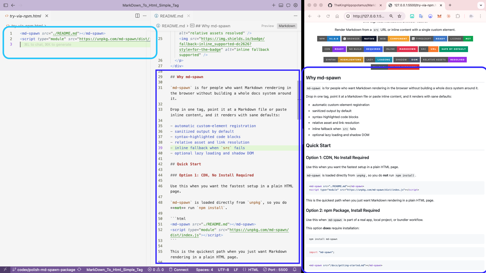

<div align="center">
  
  <h1>md-spawn</h1>
  <p><strong>One tag. Real Markdown. Browser-native.</strong></p>
  <p>Render Markdown from a <code>src</code> URL or inline content with a single custom element.</p>
  <p>
    
    
    
    
    
  </p>
  <p>
    
    
    
    
    
  </p>
  <p>
    
    
    
    
    
  </p>
</div>

## Why md-spawn

`md-spawn` is for people who want Markdown rendering in the browser without building a whole docs system around it.

Drop in one tag, point it at a Markdown file or paste inline content, and it renders with sane defaults:

- automatic custom-element registration
- sanitized output by default
- syntax-highlighted code blocks
- relative asset and link resolution
- inline fallback when `src` fails
- optional lazy loading and shadow DOM

## Preview

<div align="center">
  
</div>

See the quick-start snippet on the left, the Markdown source in the middle, and the rendered result on the right.

## Quick Start

### Option 1: CDN, No Install Required

Use this when you want the fastest setup in a plain HTML page.

`md-spawn` is loaded directly from `unpkg`, so you do **not** run `npm install`.

```html
<md-spawn src="./README.md"></md-spawn>
<script type="module" src="https://unpkg.com/md-spawn/dist/index.js"></script>
```

This is the quickest path when you just want Markdown rendering in a plain HTML page.

### Option 2: npm Package, Install Required

Use this when `md-spawn` is part of a real app, local project, or bundler workflow.

This option **does** require installation:

```bash
npm install md-spawn
```

```ts
import "md-spawn";
```

```html
<md-spawn src="/docs/getting-started.md"></md-spawn>
```

After the import, the `<md-spawn>` tag is registered automatically and is ready everywhere in the page.

## Usage Patterns

### Render A Markdown File

```html
<md-spawn src="/content/guide.md"></md-spawn>
```

### Write Markdown Inline

```html
<md-spawn>
# Hello from md-spawn

This content is **inline Markdown** with zero ceremony.
</md-spawn>
```

### Delay First Render

```html
<md-spawn src="/content/long-post.md" loading="lazy"></md-spawn>
```

## Tips

- Use `loading="lazy"` to wait until the element is near the viewport.
- Use `shadow` when you want the built-in theme isolated from page styles.
- Use `unsafe` only with trusted Markdown or trusted raw HTML.
- If `src` cannot be fetched and inline Markdown exists inside the tag, the inline content becomes the fallback.

## Built For

- changelogs
- release notes
- embedded docs
- markdown-driven landing sections
- browser-side previews
- lightweight content systems

## Creator

<table align="center">
  <tr>
    <td align="center">
      <a href="https://github.com/TheKingHippopotamus">
        
      </a>
      <br />
      <strong>CEO</strong>
      <br />
      Vision and product direction
    </td>
    <td align="center">
      <a href="https://github.com/TheKingHippopotamus">
        
      </a>
      <br />
      <strong>CTO</strong>
      <br />
      Architecture and technical execution
    </td>
    <td align="center">
      <a href="https://github.com/TheKingHippopotamus">
        
      </a>
      <br />
      <strong>KingHippo</strong>
      <br />
      Creator of <code>md-spawn</code>
    </td>
  </tr>
</table>

<p align="center">
  Open source by <a href="https://github.com/TheKingHippopotamus">KingHippo</a>.<br />
  One creator, one vision, product, design, and engineering moving together.
</p>

## Local Demo

```bash
npm run build
npx serve . -l 4173
```

Open `http://127.0.0.1:4173/demo/index.html`.
